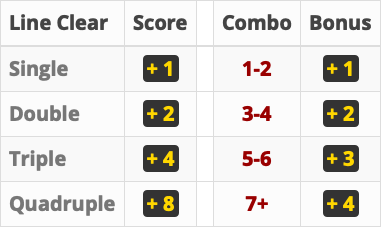

# gamer

Classic Video Games Implemented with R

> The games marked  are supported by animation effect using the idle event handler in `getGraphicsEvent {grDevices}`.
This feature could be CPU-intensive, and currently does not apply on Windows.

## Installation

```r
devtools::install_github("darrenproj/gamer")
```

## 1. Tetris 


```r
gamer::play_tetris()
```

#### Keyboard Event

- <kbd>Left</kbd> <kbd>Right</kbd> <kbd>Down</kbd> : Move
- <kbd>Up</kbd> : Rotate
- <kbd>Space</kbd> : Fall
- <kbd>A</kbd> : Alter
- <kbd>Q</kbd> : Quit

#### Scoring System


